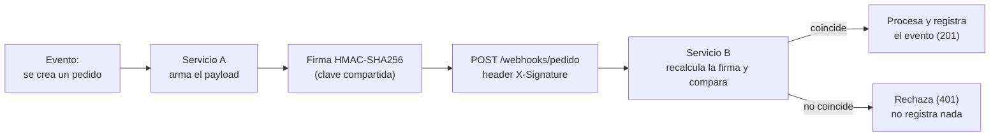
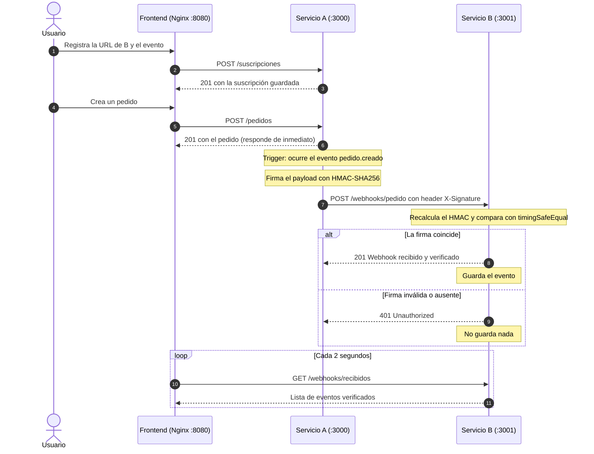

# Webhooks: Servicio A avisa a Servicio B

Proyecto de **Paradigmas de Programación** · Investigación sobre webhooks.

Dos servicios NestJS se comunican con un webhook firmado con HMAC-SHA256, y un frontend en React permite ver todo el recorrido en vivo. Todo corre con Docker Compose.

## Contenido

1. [Tema seleccionado](#1-tema-seleccionado)
2. [Diagrama](#2-diagrama)
3. [Cómo ejecutar](#3-cómo-ejecutar)
4. [Cómo probar el escenario](#4-cómo-probar-el-escenario)
5. [Explicación del flujo de comunicación](#5-explicación-del-flujo-de-comunicación)
6. [Repositorios y estructura](#6-repositorios-y-estructura)

---

## 1. Tema seleccionado

**Webhooks.** Un webhook es una petición HTTP (normalmente un `POST`) que un sistema envía por su cuenta a una URL que otro sistema registró de antemano, en el momento en que ocurre un evento. Es un modelo *push*: quien tiene la información avisa, en vez de esperar a que le pregunten.

Se contrasta con el *polling* (modelo *pull*), en el que el interesado consulta cada cierto tiempo si hay novedades. Un ejemplo cotidiano: darle tu número a una empresa de envíos para que te avisen cuando llegue el paquete, en lugar de llamar cada cinco minutos a preguntar.

**Escenario implementado.** Cuando se crea un pedido en el Servicio A, este notifica automáticamente al Servicio B con los datos del pedido (`id`, `producto`, `monto`, `fecha`). Nadie llama manualmente a B: A lo hace como consecuencia de otra acción. Como el endpoint de B es público, cada mensaje va firmado con HMAC para que B pueda comprobar que es legítimo y que no fue alterado.

## 2. Diagrama

**Vista mínima del recorrido:**



**Secuencia completa, incluyendo el frontend:**



## 3. Cómo ejecutar

**Requisitos:** Git y Docker con Compose v2 (Docker Desktop lo incluye).

Cada servicio vive en su propio repositorio. Se clona el repo de infraestructura y, **dentro** de esa carpeta, los otros tres:

```bash
# 1. Infraestructura: docker-compose.yml, run.sh, run.ps1 y .env.example
git clone https://github.com/Camilo-FG/investigacion-webhooks-infra-.git investigacion-webhooks
cd investigacion-webhooks

# 2. Los tres servicios, como carpetas hermanas dentro de la anterior
git clone https://github.com/Keril-valle/servicio-a.git
git clone -b development https://github.com/Luz-Davila/servicio-b.git
git clone https://github.com/Camilo-FG/investigacionwebhooksfrontend.git frontend

# 3. Variables de entorno (este paso es obligatorio)
cp .env.example .env

# 4. Levantar todo
./run.sh          # macOS / Linux (la primera vez: chmod +x run.sh)
# .\run.ps1       # Windows (PowerShell)
```

Al terminar, el script imprime **`Abrir: http://localhost:8080`**. La primera ejecución tarda unos minutos porque Docker descarga las imágenes y compila los tres servicios.

Dos detalles importantes:

- **Servicio B debe clonarse desde la rama `development`.** La rama `main` solo tiene el esqueleto vacío, sin el receptor del webhook.
- **No omitas `cp .env.example .env`.** Sin ese archivo, Docker Compose deja `HMAC_SECRET` vacío en ambos servicios. El sistema seguiría funcionando porque los dos coinciden, pero firmaría con una clave vacía, que no protege nada.

### Puertos y variables

| Recurso | Valor | Para qué |
|---|---|---|
| `http://localhost:8080` | Frontend (Nginx) | Única URL necesaria para usar la aplicación |
| `http://localhost:3000` | Servicio A | Expuesto para probar con `curl` |
| `http://localhost:3001` | Servicio B | Expuesto para probar con `curl` |
| `HMAC_SECRET` (`.env`) | Clave compartida | **Debe ser idéntica** en A y B, o la firma nunca verifica |
| `PORT_A`, `PORT_B`, `PORT_FRONTEND` | Puertos del host | Opcionales, para cambiar los puertos por defecto |

Dentro de la red de Docker los servicios se ven por su nombre (`http://service-a:3000`, `http://service-b:3001`), **no** por `localhost`. Por eso la URL de suscripción que se registra es `http://service-b:3001/webhooks/pedido`.

### Detener y reproducir desde cero

```bash
docker compose down        # detiene los contenedores
docker compose down -v     # además elimina volúmenes (arranque totalmente limpio)
```

### Alternativa sin Docker (desarrollo)

Con Node 20 o superior, en tres terminales:

```bash
cd servicio-a && npm install && npm run start      # :3000
cd servicio-b && npm install && npm run start      # :3001 (rama development)
cd frontend   && npm install && npm run dev        # :8080, con proxy hacia A y B
```

En este modo la URL de suscripción es `http://localhost:3001/webhooks/pedido` (el frontend la propone automáticamente). Si el puerto 3000 o 3001 está ocupado, se puede cambiar con `PORT=3002 npm run start` en el servicio y `PORT_A=3002 npm run dev` (o `PORT_B`) en el frontend.

## 4. Cómo probar el escenario

### Opción A: desde la interfaz

1. **Suscríbete.** En el paso 1, deja la URL `http://service-b:3001/webhooks/pedido` y pulsa *Registrar suscripción*.
2. **Crea un pedido.** En el paso 2, pulsa *Crear pedido y disparar webhook*. Ese es el trigger.
3. **Mira el resultado.** El diagrama se anima con el recorrido (pedido, firma, envío, verificación) y, en unos segundos como máximo, aparece una fila en la tabla *Lo que recibe el Servicio B*, con la latencia real del webhook.
4. **Prueba la seguridad.** Pulsa *Enviar webhook con firma falsa*: B responde `401` y no se registra ningún evento.

### Opción B: con `curl`

Todos los comandos se ejecutan desde la carpeta del proyecto.

**1. Registrar la suscripción** (A guardará a qué URL avisar):

```bash
curl -X POST http://localhost:3000/suscripciones \
  -H "Content-Type: application/json" \
  -d '{"url":"http://service-b:3001/webhooks/pedido","event":"pedido.creado"}'
```

**2. Crear un pedido** (el trigger):

```bash
curl -X POST http://localhost:3000/pedidos \
  -H "Content-Type: application/json" \
  -d '{"producto":"Café","monto":12.5}'
```

**3. Ver lo que recibió B** (la evidencia de que la comunicación ocurrió):

```bash
curl http://localhost:3001/webhooks/recibidos
docker compose logs service-b     # línea: "Webhook recibido y verificado: {...}"
```

**4. Probar la verificación de la firma:**

```bash
# a) Firma inventada -> 401 "Firma inválida"
curl -i -X POST http://localhost:3001/webhooks/pedido \
  -H "Content-Type: application/json" -H "X-Signature: firma-falsa" \
  -d '{"id":"x","producto":"Falso","monto":1}'

# b) Firma válida calculada a mano con la clave del .env -> 201
SECRET=$(grep '^HMAC_SECRET=' .env | cut -d= -f2)
BODY='{"id":"manual-1","producto":"Manual","monto":5,"fecha":"2026-01-01T00:00:00.000Z"}'
SIG=$(printf '%s' "$BODY" | openssl dgst -sha256 -hmac "$SECRET" | awk '{print $NF}')
curl -i -X POST http://localhost:3001/webhooks/pedido \
  -H "Content-Type: application/json" -H "X-Signature: $SIG" -d "$BODY"

# c) Misma firma, pero con el monto alterado -> 401 (la firma ya no corresponde al contenido)
curl -i -X POST http://localhost:3001/webhooks/pedido \
  -H "Content-Type: application/json" -H "X-Signature: $SIG" \
  -d '{"id":"manual-1","producto":"Manual","monto":5000,"fecha":"2026-01-01T00:00:00.000Z"}'
```

Lo que demuestra: solo quien conoce la clave puede producir una firma válida (b), y cualquier cambio en el contenido invalida la firma (c). La firma **no** oculta el contenido; solo garantiza autenticidad e integridad.

**5. Ver qué pasa si el receptor está caído** (la principal desventaja de los webhooks):

```bash
docker compose stop service-b
curl -X POST http://localhost:3000/pedidos -H "Content-Type: application/json" -d '{"producto":"Con B caído","monto":1}'
docker compose start service-b
curl http://localhost:3001/webhooks/recibidos      # el pedido NO aparece: el evento se perdió
```

A hace tres intentos en menos de un segundo (el original y dos reintentos) y luego se rinde, dejando el error en su log (`docker compose logs service-a`). Cuando B vuelve, nadie le reenvía lo que se perdió.

## 5. Explicación del flujo de comunicación

Todo empieza con una **suscripción**: alguien (la interfaz o un `curl`) le indica al Servicio A la URL a la que debe avisar, que es la del Servicio B, y el evento que interesa, `pedido.creado`. A guarda esa información en memoria. Es el equivalente a dar tu número de teléfono para que te avisen cuando el paquete llegue.

Luego ocurre el **trigger**. Cuando se hace `POST /pedidos`, A guarda el pedido, responde de inmediato al cliente y, por su cuenta, busca qué suscripciones existen para `pedido.creado`. Para cada una arma el payload (`id`, `producto`, `monto`, `fecha`), calcula su firma HMAC-SHA256 con la clave compartida y lo envía por `POST` a la URL registrada, con la firma en el header `X-Signature`. El envío es asíncrono: quien creó el pedido no espera a que el webhook termine. Si el envío falla, A lo intenta hasta tres veces en total (el original y dos reintentos, con esperas de 250 y 500 ms) y, si sigue fallando, registra el error.

Del otro lado, B recibe el `POST` en `/webhooks/pedido`. Como ese endpoint es público y no hay usuario autenticado, su seguridad depende de la firma: B recalcula el HMAC sobre el cuerpo exacto que recibió, con su copia de la clave, y lo compara con el header usando `crypto.timingSafeEqual`. Si coincide, guarda el evento y responde `201`; si no coincide o falta el header, responde `401` y no guarda nada. El frontend consulta cada 2 segundos a B para mostrar los eventos, y todas sus peticiones pasan por un proxy Nginx (`/api/a/*` y `/api/b/*`), de modo que el navegador ve un único origen y no se topa con el bloqueo de CORS. A y B además tienen `enableCors()` habilitado.

## 6. Repositorios y estructura

| Repositorio | Contenido |
|---|---|
| [servicio-a](https://github.com/Keril-valle/servicio-a) | Dispara el webhook: suscripciones, pedidos, firma HMAC y reintentos |
| [servicio-b](https://github.com/Luz-Davila/servicio-b) (rama `development`) | Recibe el webhook, verifica la firma y guarda los eventos |
| [investigacion-webhooks-infra-](https://github.com/Camilo-FG/investigacion-webhooks-infra-) | `docker-compose.yml`, `run.sh`, `run.ps1`, `.env.example` |
| [investigacionwebhooksfrontend](https://github.com/Camilo-FG/investigacionwebhooksfrontend) | Interfaz React + Nginx con proxy hacia A y B |

```text
investigacion-webhooks/          <- repo de infraestructura
├── docker-compose.yml
├── .env.example  ->  .env       <- copiar antes de ejecutar
├── run.sh / run.ps1
├── servicio-a/                  <- clonado dentro (ignorado por el repo de infra)
├── servicio-b/
└── frontend/
```

**Tecnologías:** NestJS 11 (A y B), React 18 + Vite (frontend), Nginx (servidor estático y proxy), Docker Compose, módulo `crypto` de Node para HMAC-SHA256.

**Limitaciones conocidas.** Por ser un ejemplo académico, A y B guardan todo en memoria (un reinicio borra suscripciones, pedidos y eventos recibidos), los reintentos de A duran menos de un segundo, y B no distingue mensajes repetidos.