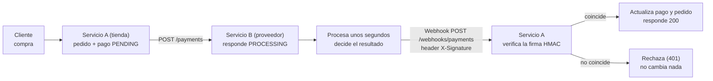
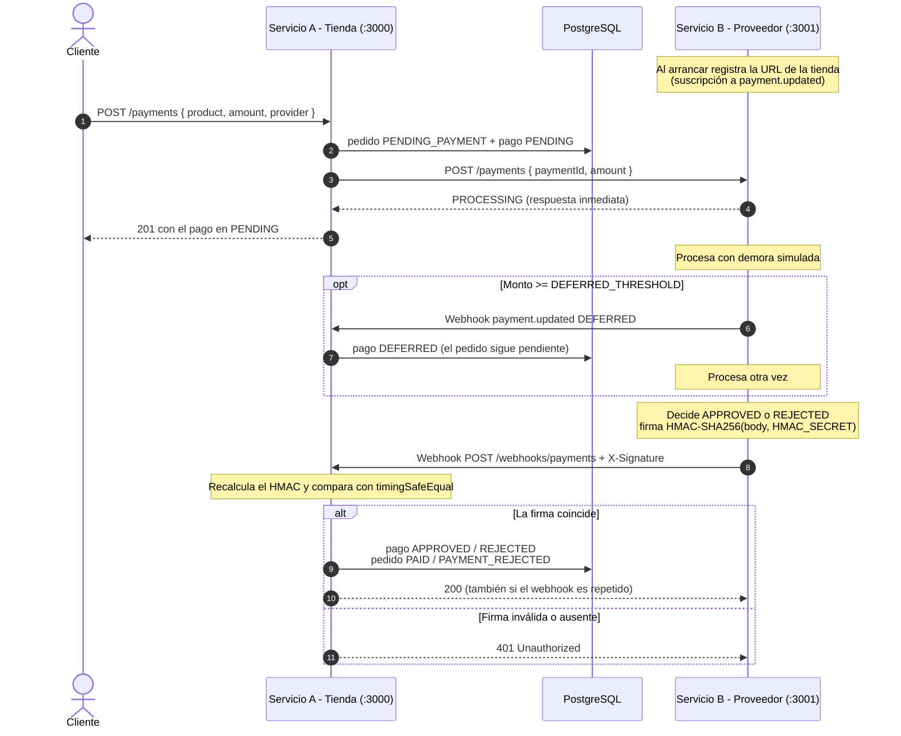

# Webhooks: confirmación automática de pagos

Proyecto de **Paradigmas de Programación** · Investigación sobre webhooks.

Una tienda (Servicio A, Store / Merchant API) envía pagos a un proveedor de pagos simulado (Servicio B, Fake Payment Provider). El proveedor procesa el pago con una demora y **avisa el resultado a la tienda con un webhook firmado con HMAC-SHA256**. Los dos servicios son NestJS, los pedidos y pagos se guardan en PostgreSQL (Supabase) y todo corre con Docker Compose.

## Contenido

1. [Tema seleccionado](#1-tema-seleccionado)
2. [Diagrama](#2-diagrama)
3. [Cómo ejecutar](#3-cómo-ejecutar)
4. [Cómo probar el escenario](#4-cómo-probar-el-escenario)
5. [Explicación del flujo de comunicación](#5-explicación-del-flujo-de-comunicación)
6. [Repositorios y estructura](#6-repositorios-y-estructura)

---

## 1. Tema seleccionado

**Webhooks.** Un webhook es una petición HTTP (normalmente un `POST`) que un sistema envía por su cuenta a una URL que otro sistema registró de antemano, en el momento en que ocurre un evento. Es un modelo *push*: quien tiene la información avisa, en vez de esperar a que le pregunten.

Se contrasta con el *polling* (modelo *pull*), en el que el interesado consulta cada cierto tiempo si hay novedades. Sin webhook, la tienda tendría que preguntarle al proveedor cada pocos segundos "¿ya se aprobó el pago?".

**Escenario implementado.** Un cliente compra un producto. La tienda crea el pedido y su pago en estado `PENDING` y se lo envía al proveedor. El proveedor responde de inmediato "recibido" (`PROCESSING`), procesa el pago durante unos segundos y, cuando decide el resultado, envía un webhook a la tienda. La tienda verifica la firma y actualiza el pago y el pedido. Es el mismo modelo que usan Stripe u Onvo.

## 2. Diagrama

**Vista mínima del recorrido:**


```mermaid
flowchart LR
    C["Cliente<br/>compra"] --> A1["Servicio A (tienda)<br/>pedido + pago PENDING"]
    A1 -->|POST /payments| B1["Servicio B (proveedor)<br/>responde PROCESSING"]
    B1 --> P["Procesa unos segundos<br/>decide el resultado"]
    P -->|"Webhook POST /webhooks/payments<br/>header X-Signature"| A2["Servicio A<br/>verifica la firma HMAC"]
    A2 -->|coincide| OK["Actualiza pago y pedido<br/>responde 200"]
    A2 -->|no coincide| NO["Rechaza (401)<br/>no cambia nada"]
```

**Secuencia completa:**


```mermaid
sequenceDiagram
    autonumber
    actor U as Cliente
    participant A as Servicio A - Tienda (:3000)
    participant DB as PostgreSQL
    participant B as Servicio B - Proveedor (:3001)

    Note over B: Al arrancar registra la URL de la tienda<br/>(suscripción a payment.updated)
    U->>A: POST /payments { product, amount, provider }
    A->>DB: pedido PENDING_PAYMENT + pago PENDING
    A->>B: POST /payments { paymentId, amount }
    B-->>A: PROCESSING (respuesta inmediata)
    A-->>U: 201 con el pago en PENDING
    Note over B: Procesa con demora simulada
    opt Monto >= DEFERRED_THRESHOLD
        B->>A: Webhook payment.updated DEFERRED
        A->>DB: pago DEFERRED (el pedido sigue pendiente)
        Note over B: Procesa otra vez
    end
    Note over B: Decide APPROVED o REJECTED<br/>firma HMAC-SHA256(body, HMAC_SECRET)
    B->>A: Webhook POST /webhooks/payments + X-Signature
    Note over A: Recalcula el HMAC y compara con timingSafeEqual
    alt La firma coincide
        A->>DB: pago APPROVED / REJECTED<br/>pedido PAID / PAYMENT_REJECTED
        A-->>B: 200 (también si el webhook es repetido)
    else Firma inválida o ausente
        A-->>B: 401 Unauthorized
    end
```

## 3. Cómo ejecutar

**Requisitos:** Git y Docker con Compose v2 (Docker Desktop lo incluye).

Cada servicio vive en su propio repositorio. Se clona el repo de infraestructura y, **dentro** de esa carpeta, los otros tres:

```bash
# 1. Infraestructura: docker-compose.yml, run.sh, run.ps1 y .env.example
git clone https://github.com/Camilo-FG/investigacion-webhooks-infra-.git investigacion-webhooks
cd investigacion-webhooks

# 2. Los tres servicios, como carpetas hermanas dentro de la anterior
git clone https://github.com/Keril-valle/servicio-a.git
git clone https://github.com/Luz-Davila/servicio-b.git
git clone https://github.com/Camilo-FG/investigacionwebhooksfrontend.git

# 3. Variables de entorno (este paso es obligatorio)
cp .env.example .env      # luego completar DATABASE_URL

# 4. Levantar todo
./run.sh          # macOS / Linux (la primera vez: chmod +x run.sh)
# .\run.ps1       # Windows (PowerShell)
```

Al terminar, el script imprime **`Abrir: http://localhost:8080`**. La primera ejecución tarda unos minutos porque Docker descarga las imágenes y compila los tres servicios.

Detalles importantes:

- **`DATABASE_URL` debe apuntar al proyecto de Supabase del equipo**, y las migraciones de `servicio-a/supabase/migrations/` deben estar aplicadas (`supabase db push` o pegando los archivos en el SQL Editor, en orden).
- **No omitas `cp .env.example .env`.** Sin ese archivo, `HMAC_SECRET` queda vacío y la firma no protege nada.

### Con las imágenes de Docker Hub (sin compilar)

Las tres imágenes están publicadas en Docker Hub ([servicio-a](https://hub.docker.com/r/camilitofge/webhooks-servicio-a), [servicio-b](https://hub.docker.com/r/camilitofge/webhooks-servicio-b), [frontend](https://hub.docker.com/r/camilitofge/webhooks-frontend)). Con ellas no hace falta descargar dependencias de npm ni compilar; sirve en redes que bloquean npm. Solo se necesitan esta carpeta (`docker-compose.yml`) y el `.env`:

```bash
cp .env.example .env      # completar HMAC_SECRET, DATABASE_URL y, para ONVO, sus claves
docker compose pull       # descarga las imágenes publicadas
docker compose up -d      # levanta sin compilar (no usar --build)
```

Para publicar una versión nueva: `docker compose build` y luego `docker compose push` (requiere `docker login` con la cuenta `camilitofge`).

### Puertos y variables

| Recurso | Valor | Para qué |
|---|---|---|
| `http://localhost:8080` | Frontend (Nginx) | Interfaz de la demo |
| `http://localhost:3000` | Servicio A (tienda) | Expuesto para probar con `curl` |
| `http://localhost:3001` | Servicio B (proveedor) | Expuesto para probar con `curl` |
| `HMAC_SECRET` | Clave compartida | **Debe ser idéntica** en A y B, o la firma nunca verifica |
| `DATABASE_URL` | PostgreSQL de Supabase | Pedidos y pagos de la tienda |
| `PROCESSING_DELAY_MS` | `3000` | Demora simulada del proveedor |
| `DEFERRED_THRESHOLD` | `50000` | Desde este monto el pago pasa primero por `DEFERRED` |
| `PORT_A`, `PORT_B`, `PORT_FRONTEND` | Puertos del host | Opcionales |

Dentro de la red de Docker los servicios se ven por su nombre (`http://service-a:3000`, `http://service-b:3001`), **no** por `localhost`. Por eso la URL de webhook que el proveedor registra para la tienda es `http://service-a:3000/webhooks/payments` (Compose la configura con `DEFAULT_WEBHOOK_URL`).

### Detener y reproducir desde cero

```bash
docker compose down        # detiene los contenedores
docker compose down -v     # además elimina volúmenes
```

### Alternativa sin Docker (desarrollo)

Con Node 20 o superior, sin tener que reconstruir contenedores (cada servicio se recarga solo al guardar):

```powershell
powershell -ExecutionPolicy Bypass -File .\run-local.ps1
```

El script apaga los contenedores si están arriba (usan los mismos puertos), instala dependencias si faltan y abre una ventana por servicio: A en `:3000`, B en `:3001` y el frontend en `:8080`.

Usa **el mismo `.env` de la carpeta raíz** que Docker (paso 3): A y B lo leen al arrancar. Ya trae `SERVICE_B_URL` y `DEFAULT_WEBHOOK_URL` apuntando a `localhost`; Docker las ignora porque `docker-compose.yml` define las suyas con los nombres `service-a` y `service-b`. Solo hace falta completar `HMAC_SECRET` y `DATABASE_URL`.

Para hacerlo a mano (por ejemplo en Mac o Linux): `npm install` y `npm run start:dev` en `servicio-a` y `servicio-b`, y `npm install` y `npm run dev` en `investigacionwebhooksfrontend`.

Si se corre un servicio solo, sin la carpeta de infraestructura, cada uno tiene su propio `.env.example` para copiar como `.env`. Si existen los dos archivos, manda el de la raíz, y una variable definida en el sistema (como las de Docker) siempre gana sobre cualquier archivo.

## 4. Cómo probar el escenario

### Reglas del proveedor simulado

| Monto | Webhooks que envía B | Estado final del pago | Estado final del pedido |
|---|---|---|---|
| Parte entera par (ej. `15000`) | `APPROVED` | `APPROVED` | `PAID` |
| Parte entera impar (ej. `15001`) | `REJECTED` | `REJECTED` | `PAYMENT_REJECTED` |
| `>= 50000` (ej. `60000`) | `DEFERRED` y luego el resultado final | `APPROVED` o `REJECTED` | `PAID` o `PAYMENT_REJECTED` |

### Opción A: desde la interfaz

Abre `http://localhost:8080`, ingresa un monto y procesa el pago con el proveedor `FAKE`. El pago aparece en `PENDING` y, unos segundos después, cambia solo a `APPROVED` o `REJECTED`: ese cambio lo provoca el webhook.

La interfaz muestra la evidencia de cada lado:

| Dónde | Qué muestra | Responde a |
|---|---|---|
| Clic en un pedido | Línea de tiempo del pago: creado, recibido por el proveedor, cada webhook enviado y qué hizo la tienda con él, con hora y milisegundos | Flujo asíncrono completo |
| Clic en un webhook enviado | Petición exacta: URL, cabeceras (`X-Signature`), cuerpo firmado, respuesta de la tienda e intentos | Qué se transmite |
| Webhooks recibidos por la tienda | Todo lo que llegó a A: aplicado, repetido, firma inválida o tienda caída | Quién procesa |
| Botón Reenviar | Manda otra vez los mismos bytes con la misma firma; la tienda responde `200` con `applied: false` | Idempotencia |
| Simular tienda caída | El endpoint de webhooks de A responde `503`; B reintenta 3 veces y marca la entrega como fallida | Reintentos y recuperación |

**Guion para mostrar fallos y recuperación:** enciende *Simular tienda caída*, compra con `15000` y espera: la entrega aparece como *Falló* tras 3 intentos y el pedido sigue esperando. Apaga la simulación, abre esa entrega y pulsa *Reenviar*: la tienda la aplica y el pedido queda pagado. Pulsa *Reenviar* otra vez: `200`, sin cambios.

### Opción B: con `curl`

En PowerShell usa `curl.exe` en lugar de `curl`.

**1. Ver la URL de webhook registrada en el proveedor:**

```bash
curl http://localhost:3001/suscripciones
```

**2. Comprar (crea el pedido y el pago en `PENDING`):**

```bash
curl -X POST http://localhost:3000/payments \
  -H "Content-Type: application/json" \
  -d '{"product":"Producto A","amount":15000,"provider":"FAKE"}'
```

**3. Ver el resultado unos segundos después** (la evidencia de que el webhook llegó):

```bash
curl http://localhost:3000/payments        # status: APPROVED
curl http://localhost:3000/pedidos         # status: PAID
curl http://localhost:3001/webhooks/entregas   # cada webhook enviado: petición exacta, respuesta e intentos
curl http://localhost:3000/webhooks/recibidos  # cada webhook que llegó a la tienda y qué hizo con él
curl http://localhost:3001/payments            # lo que sabe el proveedor de cada cobro
docker compose logs service-b              # "Webhook payment.updated (APPROVED) entregado a ..."
```

**4. Probar la verificación de la firma:**

```bash
# a) Firma inventada -> 401
curl -i -X POST http://localhost:3000/webhooks/payments \
  -H "Content-Type: application/json" -H "X-Signature: firma-falsa" \
  -d '{"event":"payment.updated","paymentId":"d81f874c-c790-4e4b-bf48-e0d839fa6f4a","status":"APPROVED"}'

# b) Misma petición firmada con la clave del .env (usa un paymentId real del paso 2) -> 200
SECRET=$(grep '^HMAC_SECRET=' .env | cut -d= -f2)
BODY='{"event":"payment.updated","paymentId":"<paymentId>","status":"APPROVED"}'
SIG=$(printf '%s' "$BODY" | openssl dgst -sha256 -hmac "$SECRET" | awk '{print $NF}')
curl -i -X POST http://localhost:3000/webhooks/payments \
  -H "Content-Type: application/json" -H "X-Signature: $SIG" -d "$BODY"
```

Si se repite (b), la tienda responde `200` con `applied: false`: el webhook ya estaba procesado y no se vuelve a aplicar (**idempotencia**).

**5. Ver qué pasa si la tienda está caída** (la principal desventaja de los webhooks):

```bash
curl -X PUT http://localhost:3000/webhooks/simulacion -H "Content-Type: application/json" \
  -d '{"storeDown":true}'                      # el endpoint de webhooks responde 503
curl -X POST http://localhost:3000/payments -H "Content-Type: application/json" \
  -d '{"amount":15000,"provider":"FAKE"}'
curl http://localhost:3001/webhooks/entregas   # result: FAILED, attempts: 3
curl http://localhost:3000/payments            # el pago se quedó en PENDING

curl -X PUT http://localhost:3000/webhooks/simulacion -H "Content-Type: application/json" \
  -d '{"storeDown":false}'
curl -X POST http://localhost:3001/webhooks/entregas/<id-de-la-entrega>/reenviar   # applied: true
curl -X POST http://localhost:3001/webhooks/entregas/<id-de-la-entrega>/reenviar   # applied: false
```

B hace tres intentos (esperando 0,5 s y 1 s entre ellos) y se rinde. El webhook perdido no se reenvía solo: hay que reenviarlo a mano, y como la tienda es idempotente, reenviarlo de más no hace daño.

## 5. Explicación del flujo de comunicación

Todo empieza con una **suscripción**: el proveedor (Servicio B) guarda a qué URL debe avisar y para qué evento (`payment.updated`). En la demo, Compose registra la URL de la tienda al arrancar, igual que en Stripe u Onvo se registra la URL de webhook en su panel. También se puede registrar con `POST /suscripciones`.

Cuando el cliente compra, la tienda (Servicio A) crea en una sola transacción el **pedido** (`PENDING_PAYMENT`) y su **pago** (`PENDING`) en PostgreSQL, y le envía al proveedor `POST /payments` con el `paymentId` y el monto. El proveedor responde de inmediato `PROCESSING`: esa respuesta **no** aprueba nada, solo confirma que recibió la solicitud.

Luego el proveedor procesa el pago con una demora simulada y decide el resultado. Arma el payload (`event`, `paymentId`, `externalPaymentId`, `status`), calcula su firma HMAC-SHA256 con la clave compartida y lo envía por `POST` a cada URL suscrita, con la firma en el header `X-Signature`. Si el envío falla, lo intenta hasta tres veces (con esperas de 500 ms y 1 s) y deja registrada cada entrega en `GET /webhooks/entregas`, con los bytes exactos, las cabeceras, la respuesta de la tienda y cada intento. Una entrega se puede reenviar con `POST /webhooks/entregas/:id/reenviar`.

La tienda recibe el webhook en `/webhooks/payments`. Como ese endpoint es público, su seguridad depende de la firma: recalcula el HMAC sobre los bytes exactos que recibió y lo compara con `crypto.timingSafeEqual`. Si no coincide responde `401`. Si coincide, actualiza el pago **solo si está en un estado anterior permitido** (`PENDING` o `DEFERRED`) y, en la misma transacción, cierra el pedido (`PAID` o `PAYMENT_REJECTED`). Un webhook repetido o atrasado se responde con `200` sin cambiar nada, para que el proveedor no siga reintentando. Cada petición que llega, aceptada o rechazada, queda en `GET /webhooks/recibidos`.

## 6. Repositorios y estructura

| Repositorio | Contenido |
|---|---|
| [servicio-a](https://github.com/Keril-valle/servicio-a) | Tienda: pedidos, pagos en PostgreSQL y receptor del webhook (verificación HMAC, idempotencia) |
| [servicio-b](https://github.com/Luz-Davila/servicio-b) | Proveedor simulado: procesa pagos, suscripciones y envío del webhook firmado con reintentos |
| [investigacion-webhooks-infra-](https://github.com/Camilo-FG/investigacion-webhooks-infra-) | `docker-compose.yml`, `run.sh`, `run.ps1`, `.env.example` |
| [investigacionwebhooksfrontend](https://github.com/Camilo-FG/investigacionwebhooksfrontend) | Interfaz React + Nginx con proxy hacia A y B |

```text
investigacion-webhooks/          <- repo de infraestructura
├── docker-compose.yml
├── .env.example  ->  .env       <- copiar antes de ejecutar
├── run.sh / run.ps1
├── servicio-a/                  <- clonado dentro (ignorado por el repo de infra)
├── servicio-b/
└── investigacionwebhooksfrontend/
```

**Tecnologías:** NestJS 11 (A y B), PostgreSQL en Supabase, React 18 + Vite (frontend), Nginx (servidor estático y proxy), Docker Compose, módulo `crypto` de Node para HMAC-SHA256.

**Limitaciones conocidas.** Por ser un ejemplo académico, el proveedor guarda suscripciones, cobros y entregas en memoria (igual que la tienda su registro de webhooks recibidos), sus reintentos duran pocos segundos, el reenvío de un webhook fallido es manual y la firma no incluye un timestamp, así que no protege contra ataques de repetición. La segunda demo con Onvo reemplaza al proveedor simulado por uno real.
